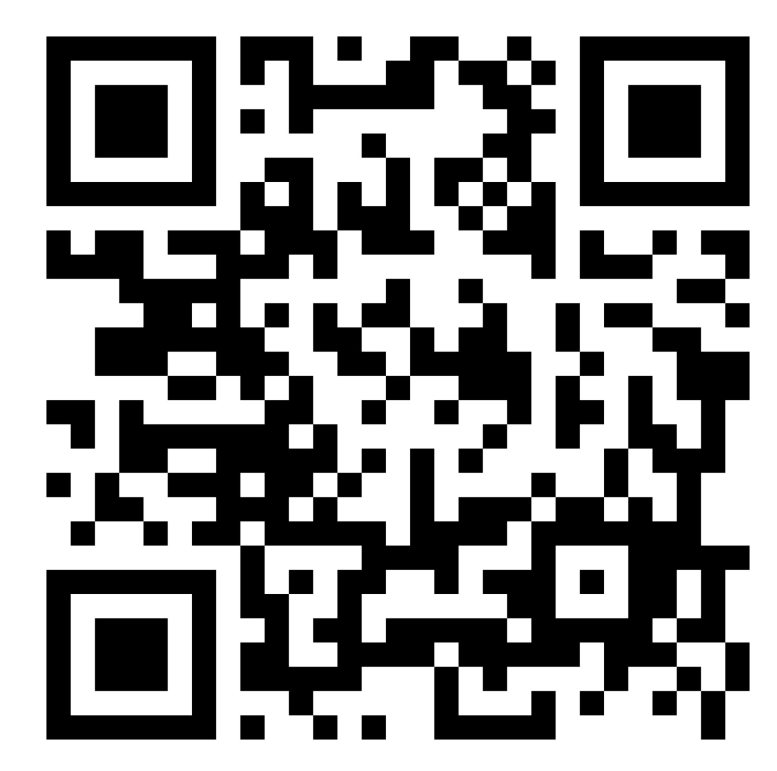

# Plano de Edições — VII Semana de Psicologia

> Este arquivo documenta, passo a passo, as 6 alterações que você pediu.
> Cada tarefa tem uma **explicação** (pra você seguir com as próprias mãos)
> e um bloco **"Prompt pronto"** (pra colar numa conversa futura comigo, ou
> com qualquer outra IA que tenha acesso ao projeto, se preferir pedir a
> execução em vez de editar manualmente).

## Sumário

- [ ] 1. Tamanho do texto "Universidade Positivo · Londrina-PR"
- [ ] 2. Painel do cronômetro ocupando a largura total
- [ ] 3. Trocar as imagens de fundo (seção do Hero + card do cronômetro)
- [ ] 4. Links reais nos botões de inscrição
- [ ] 5. Inserir a imagem do QR Code
- [ ] 6. Links em "botões de palestras" e demais botões — **precisa de uma decisão sua antes do passo a passo** (ver Tarefa 6)

**Ordem sugerida:** 4 → 5 → (1, 2 e 3 em qualquer ordem, são independentes) → 6 depois de você responder as perguntas daquela seção. O motivo de 4 vir antes de 5 está explicado lá embaixo.

---

## Tarefa 1 — Tamanho do texto "Universidade Positivo · Londrina-PR"

**Onde:** `assets/css/layout.css`, regra `.eyebrow` (o texto pequeno, em laranja, logo acima do card do cronômetro).

Hoje:
```css
.eyebrow {
  text-transform: uppercase;
  letter-spacing: 0.14em;
  font-size: 0.8rem;
  font-weight: 700;
  color: var(--color-orange-400);
  margin-bottom: 1rem;
}
```

**Passo a passo:**
1. Abra `assets/css/layout.css`.
2. Procure por `.eyebrow` (Ctrl+F).
3. Troque o valor de `font-size: 0.8rem;`. Referência: `1rem` = 16px (tamanho padrão de texto do navegador); `0.8rem` ≈ 12,8px (o atual). Pra ficar visivelmente maior sem exagerar, experimente entre `0.95rem` e `1.1rem`.
4. Salve e recarregue a página.

**Prompt pronto:**
```
No arquivo assets/css/layout.css, na regra .eyebrow, mude font-size de 0.8rem para 1rem.
```

---

## Tarefa 2 — Painel do cronômetro ocupando a largura total

**Onde:** `assets/css/layout.css`, regra `.hero-card`.

Hoje o card tem largura máxima de 900px e vive dentro de um `.container`, que por sua vez trava em 1180px com respiro de 1.5rem nas laterais (`assets/css/base.css`).

```css
.hero-card {
  position: relative;
  isolation: isolate;
  max-width: 900px;
  min-height: 440px;
  ...
}
```

"Ocupar a largura da tela toda" tem duas leituras possíveis — escolha uma:

### Opção A — Preencher o container (mais simples; ainda sobra uma margem nas bordas da tela)
```css
.hero-card {
  max-width: none; /* era 900px */
  ...
}
```

### Opção B — Borda a borda, 100% da largura da janela (sem nenhuma margem lateral)
O card "escapa" do `.container`. Consequência visual: cantos arredondados e sombra deixam de fazer sentido numa faixa que encosta nas duas bordas — por isso essa opção também zera o `border-radius`.
```css
.hero-card {
  max-width: none;
  width: 100vw;
  margin-left: calc(-50vw + 50%);
  border-radius: 0; /* sem isso os cantos ficam "flutuando" estranho */
  ...
}
```

**Minha recomendação:** se a ideia é só "o card ficar mais largo e imponente", vá de **Opção A**. Se é literalmente "sem nenhuma margem branca do lado", vá de **Opção B** — mas aí ele vira uma faixa, não mais um "cartão flutuante".

**Prompt pronto (Opção A):**
```
No arquivo assets/css/layout.css, na regra .hero-card, troque max-width: 900px por max-width: none.
```

**Prompt pronto (Opção B):**
```
No arquivo assets/css/layout.css, na regra .hero-card: troque max-width: 900px por max-width: none, adicione width: 100vw e margin-left: calc(-50vw + 50%), e mude border-radius para 0 (já que o card vai encostar nas duas bordas da tela).
```

---

## Tarefa 3 — Trocar as imagens de fundo (Hero + card do cronômetro)

São duas imagens diferentes.

### 3a. Imagem de fundo do card do cronômetro (`.hero-card`)
Já existe e já está documentada — só trocar o arquivo.

**Onde:** `assets/img/hero-card-background.jpg`

**Passo a passo:** salve a nova imagem com **esse mesmo nome**, dentro de `assets/img/`, substituindo a atual. Dimensão sugerida: ~1600×1000px, paisagem (`background-size: cover` recorta automaticamente se a proporção for diferente). Detalhes completos em `assets/img/README.md`.

**Prompt pronto:** não precisa — é só substituir o arquivo.

### 3b. Imagem de fundo da seção do Hero (o fundo claro atrás/ao redor do card)
Essa ainda **não existe como imagem** — hoje é só um degradê de cor:
```css
.hero {
  position: relative;
  overflow: hidden;
  background: linear-gradient(160deg, var(--color-lavender-50) 0%, var(--color-bg) 65%);
  padding: 3rem 0 3.5rem;
  text-align: left;
}
```

Pra adicionar uma imagem aqui mantendo o card legível por cima, uso a mesma técnica já aplicada no `.hero-card`: uma camada de imagem + uma camada de degradê por cima, com pseudo-elementos.

**Passo a passo:**
1. Salve a imagem em `assets/img/hero-section-background.jpg`.
2. Em `assets/css/layout.css`, troque a regra `.hero` por:
   ```css
   .hero {
     position: relative;
     isolation: isolate; /* sem isso, o z-index negativo abaixo pode vazar por trás do header */
     overflow: hidden;
     padding: 3rem 0 3.5rem;
     text-align: left;
   }

   .hero::before {
     content: "";
     position: absolute;
     inset: 0;
     z-index: -2;
     background-image: url("../img/hero-section-background.jpg");
     background-size: cover;
     background-position: center;
   }

   .hero::after {
     content: "";
     position: absolute;
     inset: 0;
     z-index: -1;
     background: linear-gradient(160deg, var(--color-lavender-50) 0%, var(--color-bg) 65%);
     opacity: 0.88; /* diminua pra mostrar mais a foto; aumente pra mostrar menos */
   }
   ```
   (`.hero-decor` já usa `z-index: 0` e `.hero-inner` já usa `z-index: 1` dentro do Hero — por isso -1/-2 aqui, pra tudo ficar na ordem certa: imagem → degradê → tipografia decorativa → conteúdo do card.)
3. Ajuste o `opacity` do `.hero::after` até equilibrar "dá pra ver a foto" com "o card e o texto continuam legíveis".

**Prompt pronto:**
```
No arquivo assets/css/layout.css, adicione uma imagem de fundo à seção .hero, mantendo o degradê claro atual por cima como uma camada semi-transparente para legibilidade. Use pseudo-elementos (::before para a imagem em assets/img/hero-section-background.jpg, ::after para o degradê com opacity ~0.88), com isolation: isolate na .hero para o z-index negativo não vazar por trás do header.
```

---

## Tarefa 4 — Links reais nos botões de inscrição

**Onde:** `index.html`, três lugares (todos marcados com `<!-- TODO -->` e `href="#"` — fácil achar com Ctrl+F por `href="#"`):

1. Header (dentro de `.nav-actions`): `<a href="#" class="btn btn-outline">Acesso ao site</a>`
2. Hero (dentro do `.hero-card`): `<a href="#" class="btn btn-cta">Faça sua inscrição</a>`
3. Seção "Sobre" (dentro do `.vagas-box`): `<a href="#" class="btn btn-cta">Faça sua inscrição</a>`

**Passo a passo:** troque cada `href="#"` pelo link real (formulário, página de inscrição etc.) e apague o comentário `<!-- TODO: ... -->` correspondente.

**Decisão pendente:** o botão do header diz "Acesso ao site" — texto diferente dos outros dois ("Faça sua inscrição"). Continua apontando pra outro lugar (um portal separado) ou deveria ter o mesmo link (e talvez o mesmo texto)? Já está anotado no `readme.md` também.

**Prompt pronto:**
```
No index.html, troque os três href="#" marcados com <!-- TODO: apontar para o link/formulário real de inscrição --> pelo link [COLE O LINK AQUI] e remova os comentários TODO correspondentes.
```

---

## Tarefa 5 — Inserir a imagem do QR Code

**Por que isso vem depois da Tarefa 4:** o QR Code precisa apontar pro mesmo link de inscrição — só faz sentido gerá-lo depois de decidir esse link.

**Onde:** `index.html`, dentro do `.vagas-box`:
```html
<div class="qrcode-placeholder" role="img" aria-label="Espaço reservado para QR Code de inscrição">
  <span>QR Code</span>
</div>
```

**Passo a passo:**
1. Com o link de inscrição definido (Tarefa 4), gere o QR Code (qualquer gerador online — ou me manda o link numa próxima conversa que eu gero o arquivo pra você).
2. Salve como `assets/img/qrcode-inscricao.png` (quadrado, fundo branco ou transparente).
3. Troque o `<div>` acima por:
   ```html
   
   ```
4. Em `assets/css/components.css`, a regra `.qrcode-placeholder` tem propriedades que só existiam pra centralizar o texto "QR Code" do placeholder (`display: flex`, `align-items`, `justify-content`, `font-weight`, `font-size`, e a borda tracejada `border: 2px dashed ...`). Com uma imagem de verdade, dá pra remover essas linhas e manter só `width`, `height` e `border-radius`.

**Prompt pronto:**
```
No index.html, troque o <div class="qrcode-placeholder"> dentro do .vagas-box por uma  apontando para assets/img/qrcode-inscricao.png (alt descrevendo que é o QR Code de inscrição do evento, width/height 140). Em assets/css/components.css, simplifique .qrcode-placeholder removendo as propriedades que só centralizavam o texto do placeholder (display, align-items, justify-content, font-weight, font-size, border tracejada), mantendo width, height e border-radius.
```

---

## Tarefa 6 — Links em "botões de palestras" e demais botões

Revisei o projeto inteiro: hoje **não existe nenhum "botão de palestra"** — na seção Programação, cada palestra é texto simples (horário + descrição + nome do palestrante), sem link nenhum. Antes de escrever o passo a passo, preciso que você confirme o que deveria virar clicável:

- **(a)** Cada palestra da Programação vira um link — pra onde? (currículo/Lattes do palestrante? página com resumo da palestra? outra coisa?)
- **(b)** Os nomes na Comissão Organizadora (Docentes/Discentes) viram links
- **(c)** Algo que não listei aqui

Sobre "os demais botões" — inventário completo de tudo que é clicável na página hoje:

| Elemento | Situação |
|---|---|
| Logo (topo) | ✅ âncora interna `#topo`, já funciona |
| Menu: Página Inicial / Programação / Palestrantes / Perguntas frequentes | ✅ âncoras internas, já funcionam |
| Botão de menu mobile (hambúrguer) | ✅ não precisa de link — é JS |
| Botão "Adicionar aos favoritos" | ✅ não precisa de link — é JS (localStorage) |
| Perguntas do FAQ | ✅ não precisa de link — `<details>/<summary>` nativo |
| 3 botões de inscrição | ⏳ cobertos na Tarefa 4 |

Não achei mais nenhum botão sem link além desses. Se você tinha algo específico em mente que não está nessa lista, me diga qual (e pra onde deve linkar) que eu escrevo o passo a passo certinho — arquivo, trecho de HTML e link de destino, igual às outras tarefas.

---

## Como usar este arquivo como prompt

- Cada tarefa tem um bloco **"Prompt pronto"** — copie e cole numa conversa (comigo ou com outra IA com acesso ao projeto) pra pedir só aquela mudança.
- Pra pedir várias de uma vez, cole os blocos em sequência, numerados.
- Ao descrever uma alteração de CSS pra uma IA, sempre vale citar **arquivo + nome da classe** (é basicamente o que este documento faz) — evita que ela precise adivinhar onde mexer.
- As Tarefas 1, 2, 3b, 4 e 5 dependem de um valor que só você tem (tamanho exato, imagem, link) — nesses casos o prompt pronto tem um espaço reservado (ex.: `[COLE O LINK AQUI]`) pra preencher antes de mandar.
